# EV 课程表同步器 · 页面截图清单与版本核对

> 用途：盘点安卓 App（EV 变体）共有多少页面、哪些需要截图，并规定**每张图带版本号小备注**的命名与核对方式，方便下次发版时一次性复查「哪些图该重拍」。
> 版本基线：本次截图取自真机已装版 **v0.5.166**（versionCode 167）；`version.env` 当前为 **v0.5.167**（即下次 `build.sh` 产物，构建后自动 +1）。
> 包名：`com.application.watch.classschedule`（= 对端快应用包名，配对键，不带版本号）。
> 截图目录：`apk/shots/`（已落 16 张必拍图，文件名带 `-v0.5.166`，见第七节画廊）。

---

## 一、结论速览

| 项目 | 数量 |
|---|---|
| 页面总数（Activity） | **17** |
| 需截图（用户可见，进用户文档 / 商店图） | **15 页 / 16 张**（TransferActivity 含导入+导出 2 态） |
| 可选截图（开发 / 排障页，不进对外文档） | **2 页**（DebugActivity、ConnLogActivity） |
| 额外可选（桌面 widget，非 Activity） | **3 个**（今日课程 / 下一节课 / 本周课表） |
| 本次重拍结果 | **必拍 16 张已全部落盘（v0.5.166）；可选页未拍** |

`首页与多步骤调试页设计.md` 已描述早期 4 页结构；本文件为**全量**清单，覆盖后续新增的留言 / 课表 / 手环 / 工具箱 / 主题 / 打赏 / 激活 / 电池引导等页。

---

## 二、页面全量清单（17 个 Activity）

按「用户动线」分组，括号内为类名与是否需截图。

### A. 核心 / 启动
| # | 页面（中文） | Activity | 截图 key | 需截图 | 说明 |
|---|---|---|---|---|---|
| 1 | 首页 / 启动页 | `HomeActivity` | `home` | ✅ 必拍 | 自动连接 4 步、欢迎卡、功能入口 2 列网格、底部版本号 |
| 2 | 留言（微信式对话） | `MessageActivity` | `message` | ✅ 必拍 | 对话流 + 底部快捷短语 + 快速留言弹窗 |
| 3 | 课表列表 | `ScheduleListActivity` | `schedule` | ✅ 必拍 | 多课表切换、在线绿点、⋯ 溢出菜单、同步徽标 |

### B. 设备与设置
| # | 页面（中文） | Activity | 截图 key | 需截图 | 说明 |
|---|---|---|---|---|---|
| 4 | 手环设备页 | `BandActivity` | `band` | ✅ 必拍 | 设备主卡（型号/电量）、快捷操作网格、排障入口 |
| 5 | 昵称设置 | `SettingsActivity` | `settings` | ✅ 必拍 | 读到的昵称大字 + 修改输入 + 提前时间等 |
| 6 | 首页设置（字号/模板） | `HomepageSettingsActivity` | `homepage` | ✅ 必拍 | 标准版只读提示 / Pro 可改字号模板 |
| 7 | 主题外观 | `ThemePickerActivity` | `theme` | ✅ 必拍 | 10 套主题，整页即时换装 |
| 8 | 电池优化引导 | `BatteryGuideActivity` | `battery` | ✅ 必拍 | 忽略电池优化分步指引（后台收留言前提） |

### C. 数据 / 工具
| # | 页面（中文） | Activity | 截图 key | 需截图 | 说明 |
|---|---|---|---|---|---|
| 9 | 导入 / 导出 | `TransferActivity` | `transfer-import` / `transfer-export` | ✅ 必拍（2 张） | 同一 Activity 按 mode 复用：导入说明+预览 / 导出预览+保存 |
| 10 | 工具箱 | `ToolboxActivity` | `toolbox` | ✅ 必拍 | 找手机 / 倒计时 / 问单词等工具卡 |
| 11 | 课程编辑（单课） | `CourseEditActivity` | `course-edit` | ✅ 必拍 | 周网格拖动、色块编辑、长按表头清空 |
| 12 | 课程 JSON 编辑 | `JsonEditorActivity` | `json-edit` | ✅ 必拍 | 高级：直接编课程 JSON |
| 13 | 快速激活 | `FastActivateActivity` | `activate` | ✅ 必拍 | 18 位激活码输入、设备行、常见问题 |

### D. 变现 / 特殊态
| # | 页面（中文） | Activity | 截图 key | 需截图 | 说明 |
|---|---|---|---|---|---|
| 14 | 打赏 | `DonateActivity` | `donate` | ✅ 必拍 | 微信 / 支付宝二维码（zxing 离线生成） |
| 15 | 找手机（响铃全屏） | `FindPhoneActivity` | `find-phone` | ✅ 必拍 | 特殊态：需先触发响铃才出现；固定深底醒目 |

### E. 开发 / 排障（可选，不进对外文档）
| # | 页面（中文） | Activity | 截图 key | 需截图 | 说明 |
|---|---|---|---|---|---|
| 16 | 多步骤调试 | `DebugActivity` | `debug` | ⬜ 可选 | 每步独立可点，排障用，外部不暴露 |
| 17 | 连接日志 | `ConnLogActivity` | `connlog` | ⬜ 可选 | 记录每次连接尝试，排障用 |

### F. 额外可选（非 Activity）
| # | 组件 | 截图 key | 需截图 | 说明 |
|---|---|---|---|---|
| +1 | 今日课程 widget（4×2） | `widget-today` | ⬜ 可选 | `TodayWidgetProvider` |
| +2 | 下一节课 widget（4×1） | `widget-next` | ⬜ 可选 | `NextWidgetProvider` |
| +3 | 本周课表 widget | `widget-week` | ⬜ 可选 | `WeekWidgetProvider` |

---

## 三、截图命名规范（每张图带版本号）

**文件名即版本号**，无需打开图就能看出拍的是哪一版：

```
shots/<key>-v<versionName>.png
例：shots/home-v0.5.166.png
    shots/transfer-import-v0.5.166.png
    shots/theme-v0.5.166.png
```

- `<key>` 取上表「截图 key」列（稳定，不随文案改）。
- `<versionName>` 取自 `version.env`，**每次发版后随 build.sh 自动 +1**，截图须同步重拍。
- variant 为 evbox 时，key 前缀加 `evbox-`（包名 `com.application.watch.evbox`）。

**图内小备注（版本号）**：在 md 画廊里每张图下方加一行备注，格式固定为：

```
> v<versionName> · <页面中文名> · <Activity> · <拍摄日期>
例：> v0.5.166 · 首页 · HomeActivity · 2026-10-05
```

> 不在图本身烧字（避免破坏 UI 真实性）；版本信息以「文件名 + 图下备注」双写，既满足「每张图小备注版本号」，又不污染界面截图。若强需烧进图，可用 ImageMagick：
> `convert shots/home-v0.5.166.png -gravity southeast -pointsize 18 -annotate +8+8 "v0.5.166" shots/home-v0.5.166.png`

---

## 四、本次重拍清单（v0.5.166，全部重拍）

| # | 页面 | key | 截图文件 | 上次版本 | 本次重拍 |
|---|---|---|---|---|---|
| 1 | 首页 | `home` | `shots/home-v0.5.166.png` | v0.5.166（已拍） | ✅ |
| 2 | 留言 | `message` | `shots/message-v0.5.166.png` | v0.5.166（已拍） | ✅ |
| 3 | 课表列表 | `schedule` | `shots/schedule-v0.5.166.png` | v0.5.166（已拍） | ✅ |
| 4 | 手环设备 | `band` | `shots/band-v0.5.166.png` | v0.5.166（已拍） | ✅ |
| 5 | 昵称设置 | `settings` | `shots/settings-v0.5.166.png` | v0.5.166（已拍） | ✅ |
| 6 | 首页设置 | `homepage` | `shots/homepage-v0.5.166.png` | v0.5.166（已拍） | ✅ |
| 7 | 主题外观 | `theme` | `shots/theme-v0.5.166.png` | v0.5.166（已拍） | ✅ |
| 8 | 电池引导 | `battery` | `shots/battery-v0.5.166.png` | v0.5.166（已拍） | ✅ |
| 9a | 导入 | `transfer-import` | `shots/transfer-import-v0.5.166.png` | v0.5.166（已拍） | ✅ |
| 9b | 导出 | `transfer-export` | `shots/transfer-export-v0.5.166.png` | v0.5.166（已拍） | ✅ |
| 10 | 工具箱 | `toolbox` | `shots/toolbox-v0.5.166.png` | v0.5.166（已拍） | ✅ |
| 11 | 课程编辑 | `course-edit` | `shots/course-edit-v0.5.166.png` | v0.5.166（已拍） | ✅ |
| 12 | JSON 编辑 | `json-edit` | `shots/json-edit-v0.5.166.png` | v0.5.166（已拍） | ✅ |
| 13 | 快速激活 | `activate` | `shots/activate-v0.5.166.png` | v0.5.166（已拍） | ✅ |
| 14 | 打赏 | `donate` | `shots/donate-v0.5.166.png` | v0.5.166（已拍） | ✅ |
| 15 | 找手机 | `find-phone` | `shots/find-phone-v0.5.166.png` | v0.5.166（已拍） | ✅ |
| — | 调试（可选） | `debug` | `shots/debug-v0.5.166.png` | v0.5.166（未拍） | ⬜ 按需 |
| — | 连接日志（可选） | `connlog` | `shots/connlog-v0.5.166.png` | v0.5.166（未拍） | ⬜ 按需 |

**必拍合计：16 张（15 页，Transfer 拆 2 态）。**

---

## 五、截图执行方式（可复现）

前提：手环模拟器 / 真机已 `adb` 连上（当前可用设备：`emulator-11000`、`emulator-11002`、`127.0.0.1:11003`、真机 `BTF4C17222009588`）。先装当前 APK：`adb install -r EVSyncProbe.apk`。

逐页拉起并截图（EV 变体包名）：

```bash
PKG=com.application.watch.classschedule
VER="$($ADB -s $SERIAL shell dumpsys package $PKG 2>/dev/null | grep -m1 versionName | sed 's/.*=//' | tr -d '\r')"
SHOTS=shots
mkdir -p "$SHOTS"
cap() { # $1=Activity简名 $2=key
  adb shell am start -n "$PKG/.$1" >/dev/null 2>&1
  sleep 1.2
  adb exec-out screencap -p > "$SHOTS/$2-$VER.png"
}
cap HomeActivity            home
cap MessageActivity         message
cap ScheduleListActivity    schedule
cap BandActivity            band
cap SettingsActivity        settings
cap HomepageSettingsActivity homepage
cap ThemePickerActivity     theme
cap BatteryGuideActivity    battery
cap TransferActivity        transfer-import   # 进页默认导入态；切到导出再拍一张
cap TransferActivity        transfer-export
cap ToolboxActivity         toolbox
cap CourseEditActivity      course-edit
cap JsonEditorActivity      json-edit
cap FastActivateActivity    activate
cap DonateActivity          donate
# 找手机：需先由手环/工具箱触发响铃，再截 FindPhoneActivity
cap FindPhoneActivity       find-phone
```

> 注意：模拟器 `adb server` 会丢连接（见记忆 `vela模拟器adb server会丢连接`），每条命令前可加 `adb connect 127.0.0.1:<console+1>` 自愈。FindPhoneActivity 需先进入响铃态才有内容；否则截到的是空深底。

---

## 六、下次发版核对流程（版本号对照）

每次 `bash build.sh` 后 `version.env` 自动 +1。发版前按此核对，避免「图还是旧版」：

1. 读 `version.env` 拿到新 `VERSION_NAME`（当前为 `v0.5.167`，即本次发版号）。
2. 对照本表「截图文件」列：把 `-v0.5.166.png` 全量替换为 `-v0.5.167.png` 重拍（v0.5.167 即 `version.env` 当前值与下次发版号）。
3. 在「上次版本」列回填上一版号，确认 16 张全部刷新；若某页 UI 未变，仍要重拍（版本号随包走，旧图文件名即过期）。
4. 更新文末画廊与图下备注的版本号与日期。
5. 可选：把 `shots/` 上传到 `app-auth` 站点 `ui-gallery-android` 或 GitHub Release 作为预览。

**核对口令（一眼看缺哪张）**：`ls shots/ | grep -c "v0.5.166"` 应等于 16（必拍）。不等于即漏拍。

---

## 七、截图画廊（拍完在此贴图，每张带版本号小备注）

> 已拍（v0.5.166，真机 `BTF4C17222009588`）。下列为实际落盘图，每张带版本号小备注。

```
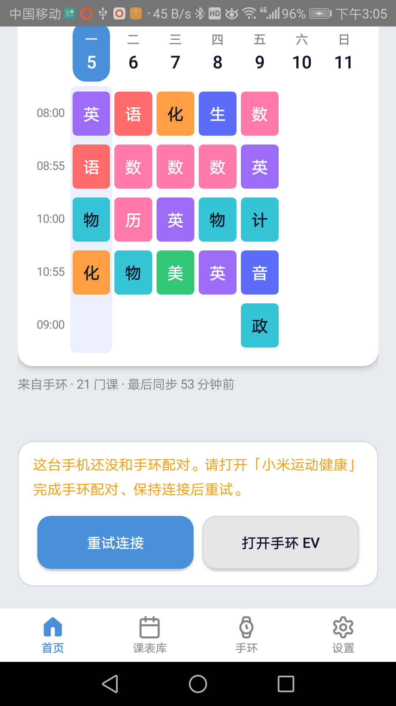
> v0.5.166 · 首页 · HomeActivity · 2026-10-05


> v0.5.166 · 留言 · MessageActivity · 2026-10-05

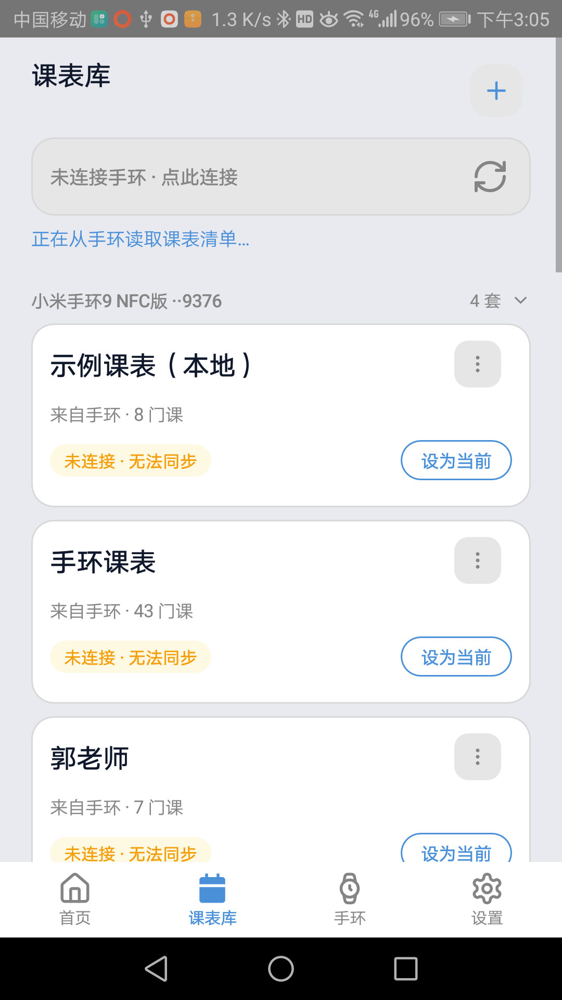
> v0.5.166 · 课表列表 · ScheduleListActivity · 2026-10-05

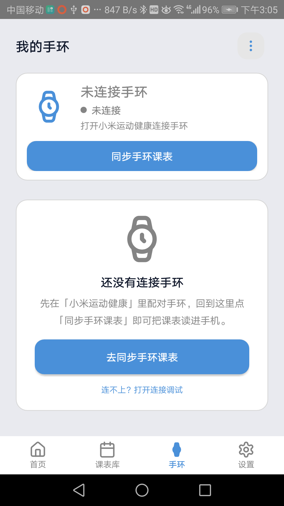
> v0.5.166 · 手环设备页 · BandActivity · 2026-10-05

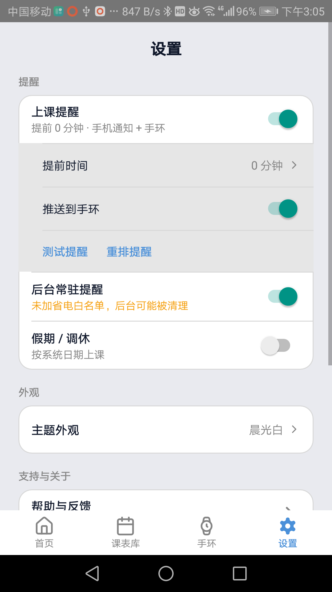
> v0.5.166 · 昵称设置 · SettingsActivity · 2026-10-05

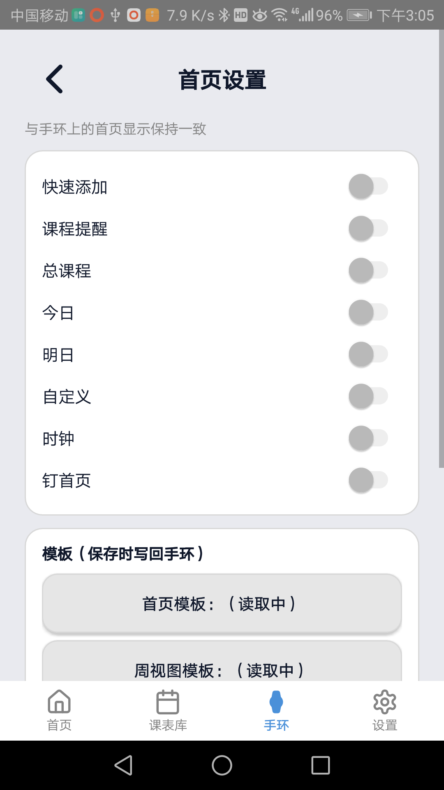
> v0.5.166 · 首页设置 · HomepageSettingsActivity · 2026-10-05

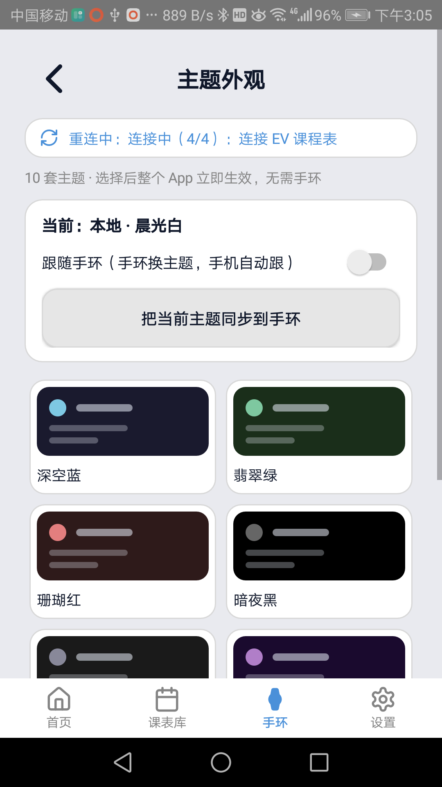
> v0.5.166 · 主题外观 · ThemePickerActivity · 2026-10-05

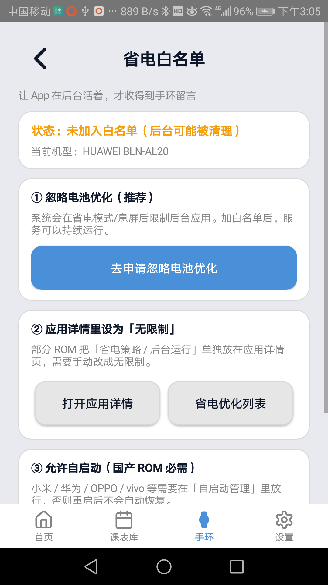
> v0.5.166 · 电池优化引导 · BatteryGuideActivity · 2026-10-05


> v0.5.166 · 导入 · TransferActivity · 2026-10-05

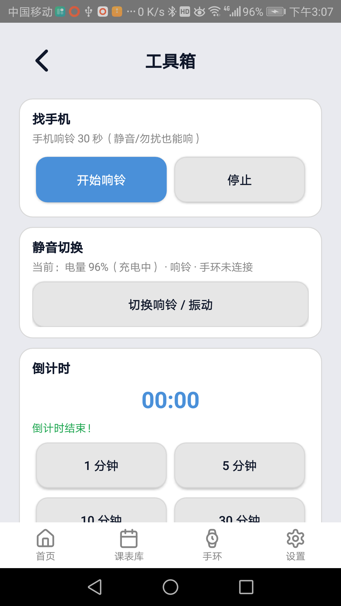
> v0.5.166 · 导出 · TransferActivity · 2026-10-05

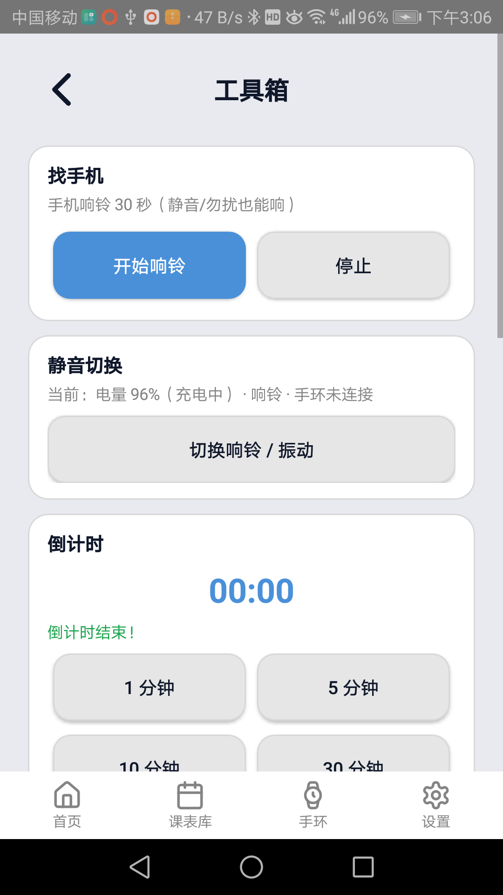
> v0.5.166 · 工具箱 · ToolboxActivity · 2026-10-05

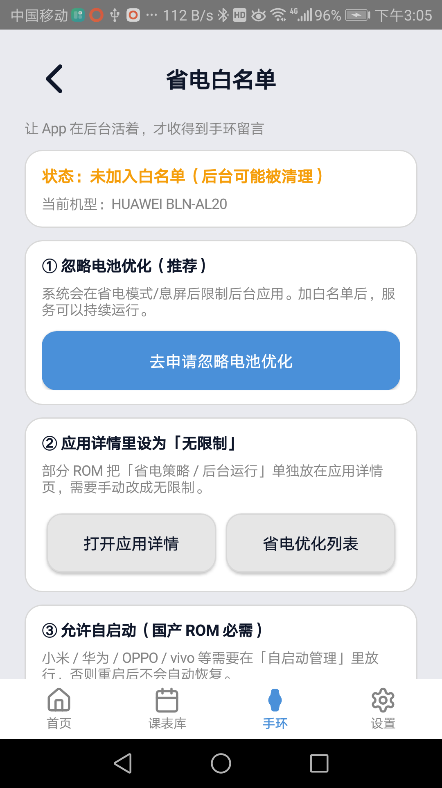
> v0.5.166 · 课程编辑 · CourseEditActivity · 2026-10-05


> v0.5.166 · 课程 JSON 编辑 · JsonEditorActivity · 2026-10-05

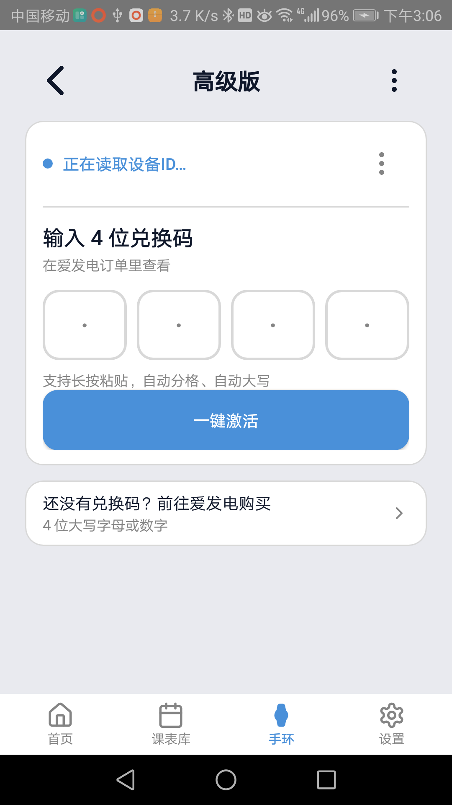
> v0.5.166 · 快速激活 · FastActivateActivity · 2026-10-05


> v0.5.166 · 打赏 · DonateActivity · 2026-10-05


> v0.5.166 · 找手机（响铃态）· FindPhoneActivity · 2026-10-05
```
